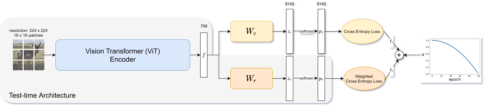

# EarlyExVit: 2-branch ViT with early exit weighting for long tail classification
 

## Credit
Code adapted from [here](https://github.com/macaodha/inat_comp_2018).

## Trained models
Trained models can be downloaded [from polybox](https://polybox.ethz.ch/index.php/s/CsgHnIu8QBKqMDr)

## Installation
```
conda create -n ai python=3.8
conda activate ai
conda install pytorch torchvision torchaudio cudatoolkit=10.2 -c pytorch
pip install timm
pip install matplotlib
```

## Reproduce Experiments
To reproduce a specific experiment you need 2 files:
- `params.py`: a file containing all hyper parameters
- `*.pth.tar`: the trained model (of course not needed when re-training from scratch)  

These files can be found [on polybox](https://polybox.ethz.ch/index.php/s/CsgHnIu8QBKqMDr). 1 folder contains 1 experiment, following the same naming as in the report.
Place both files into the root directory of this repo. Then run:
- `eval.py` to produce overall accuracy, long-tail plot, and decile evaluation
- `train_classic.py` to train a model without the early exit weighting scheme (ours (classic))
- `train_exit.py` to train a model with the early exit weighting scheme (ours (exit))
- `test.py` to produce the kaggle submission file  

Similarly, we also provide reproducability for all baselines. You can follow the same instrutions, simply using `baselines/[cnn|reweight-vit|vit]` as the root directoy and simply use `train.py` instead for training.

Note: We used Euler to train our models. As submission prefix we used `bsub -n 4 -W 96:00 -R "rusage[ngpus_excl_p=1,mem=8000]"`.
